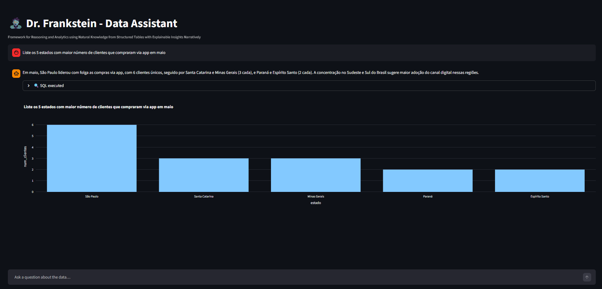
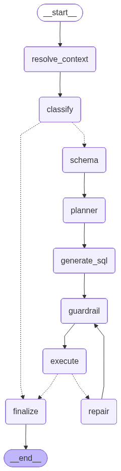
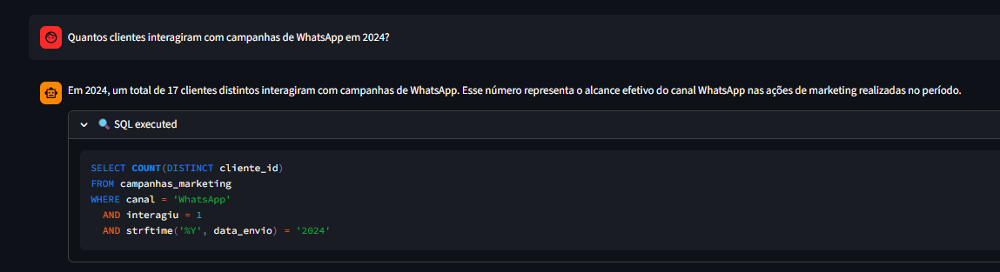
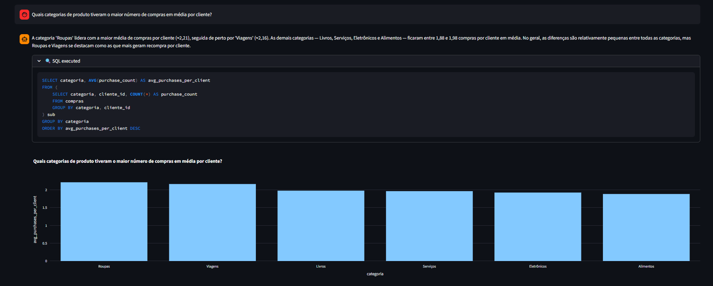
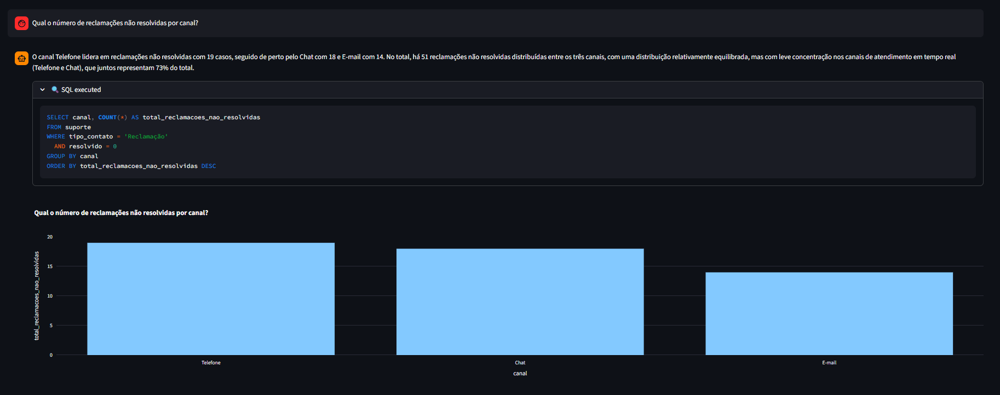
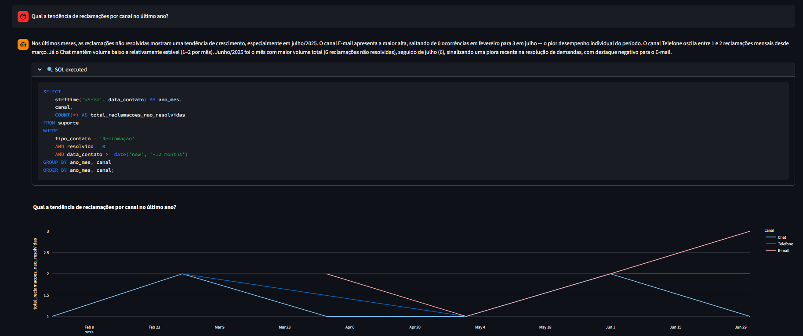

# Dr. Frankstein Data Assistant



Agente conversacional de análise de dados que responde perguntas em linguagem natural sobre um banco de dados SQLite. O agente utiliza **Claude Sonnet** como LLM, **LangGraph** para orquestração do fluxo de nós e **Streamlit** como interface web.

O usuário digita uma pergunta de negócio, o agente decide se é necessário consultar o banco, gera e executa SQL com recuperação automática de erros, e devolve uma resposta em linguagem natural acompanhada de visualização interativa via Plotly.

## Tech Stack

| Camada                 | Tecnologia                                                    |
| ---------------------- | ------------------------------------------------------------- |
| LLM                    | Claude Sonnet (`claude-sonnet-4-6`) via `langchain-anthropic` |
| Orquestração           | LangGraph                                                     |
| Interface web          | Streamlit                                                     |
| Visualização           | Plotly                                                        |
| Banco de dados         | SQLite + SQLAlchemy                                           |
| Gerenciador de pacotes | `uv`                                                          |
| Runtime                | Python 3.13                                                   |

---

## Instruções de Execução

### Pré-requisitos

- [Docker](https://docs.docker.com/get-docker/) e [Docker Compose](https://docs.docker.com/compose/) instalados
- Chave de API da Anthropic (`ANTHROPIC_API_KEY`)

### 1. Configurar variáveis de ambiente

Edite o arquivo `.env` e preencha os valores:

```env
DB_NAME=anexo_desafio_1.db
ANTHROPIC_API_KEY=sua_chave_aqui

# Opcional: rastreamento via LangSmith
LANGSMITH_TRACING=true
LANGSMITH_API_KEY=sua_chave_langsmith
LANGSMITH_PROJECT=franq-agent
```

### 2. Execução com Docker

```bash
docker-compose up --build
```

Acesse a interface em: **<http://localhost:8501>**

Para parar:

```bash
docker-compose down
```

### Alternativa: Execução Local

```bash
# Instalar dependências (requer uv)
uv sync

# Interface web
uv run streamlit run app.py
```

---

## Explicação do Fluxo de Agentes e Arquitetura Escolhida

### Fluxo geral



### Nós do grafo

| Nó                | Papel                                                                                                        |
| ----------------- | ------------------------------------------------------------------------------------------------------------ |
| `resolve_context` | Reescreve perguntas de acompanhamento como perguntas autônomas, usando o histórico da conversa               |
| `classify`        | Classifica a pergunta como `sql` (requer consulta ao banco) ou `direct` (saudação, meta-pergunta)            |
| `schema`          | Descobre dinamicamente o schema do banco (tabelas e colunas) a cada invocação                                |
| `planner`         | Cria um plano de raciocínio em JSON antes de gerar o SQL (tabelas necessárias, etapas, estratégia)           |
| `generate_sql`    | Gera uma query SQLite `SELECT` com base no plano e no schema                                                 |
| `guardrail`       | Bloqueia palavras-chave destrutivas (`DROP`, `DELETE`, `UPDATE`, `INSERT`, etc.), garantindo apenas leituras |
| `execute`         | Executa a query e captura resultados ou erros                                                                |
| `repair`          | Se a execução falhar, usa a mensagem de erro como feedback para o LLM corrigir o SQL (máx. 3 tentativas)     |
| `finalize`        | Interpreta os resultados, formula a resposta em linguagem natural e define o tipo de visualização            |

### Decisões arquiteturais

- **Arquitetura sequencial com nó de classificação:** o nó `classify` avalia se a pergunta requer acesso ao banco antes de acionar todo o pipeline de SQL. Perguntas diretas (saudações, perguntas sobre o próprio agente) são respondidas imediatamente pelo nó `finalize`, evitando latência e custo desnecessários.

- **Nó `guardrail` como camada de segurança:** antes de qualquer execução, o SQL gerado é inspecionado por palavras-chave que indicam operações de escrita ou destruição. Queries não permitidas são rejeitadas antes de chegar ao banco, protegendo a integridade dos dados.

- **Recuperação automática de erros:** o nó `repair` implementa um loop de retry limitado (máximo de 3 tentativas), usando a mensagem de erro de execução como contexto para o LLM corrigir o SQL quebrado.

- **Seleção dinâmica de visualização:** o nó `finalize` determina o tipo de gráfico mais adequado (`bar`, `line`, `pie`, `table` ou nenhum) e configura os eixos automaticamente com base na pergunta e nos dados retornados.

---

## Exemplos de Consultas Testadas

- "Liste os 5 estados com maior número de clientes que compraram via app em maio."

  

- "Quantos clientes interagiram com campanhas de WhatsApp em 2024?"

  

- "Quais categorias de produto tiveram o maior número de compras em média por cliente?"

  

- "Qual o número de reclamações não resolvidas por canal?"

  

- "Qual a tendência de reclamações por canal no último ano?"

  

---

## Sugestões de Melhorias e Extensões

- **Restringir o escopo do agente no nó de classificação:** limitar explicitamente a atuação do LLM a perguntas sobre o banco de dados. Caso a pergunta fuja desse escopo, retornar uma resposta curta e padronizada, sem acionar o pipeline SQL.

- **Migrar para execução assíncrona:** refatorar o código para usar `ainvoke` e chamadas assíncronas ao longo de todo o grafo, melhorando a escalabilidade e a responsividade da interface.

- **Integrar com FastAPI:** expor o agente como uma API REST via FastAPI, permitindo integração com outros sistemas e frontends além do Streamlit.

- **Migrar a descoberta de schema para função serverless:** mover `schema_discovery` para uma função Lambda (ou equivalente) executada periodicamente. Armazenar o schema em cache de longo prazo (ex.: Redis, S3, DynamoDB) e eliminar a necessidade de consultar o banco a cada invocação.

- **Adicionar um RAG de planos de ação:** criar uma base de conhecimento (RAG) com orientações e planos de ação associados a padrões identificados nos dados. Por exemplo: se reclamações por canal estiverem aumentando, o agente consultaria o RAG para sugerir ações corretivas ao usuário.
